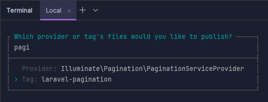

## Cousas interesantes para o futuro
* [Open swoole](https://www.youtube.com/watch?v=nGJOOS1Zd9Q&ab_channel=ThePrimeTime): fai que a aplicación sirva muitisimas peticións mais por segundo
* Laravel Idea: plugin para Laravel
* [Como activar rutas de api en Laravel 12](https://laracasts.com/discuss/channels/laravel/routesapiphp-removed-in-laravel-12-use-web-or-restore-it)
* laravel route model binding: xa carga o model no controlador sen ter que facer find()

<details>
<summary>Docker</summary>

# Docker
Me cago en dios para levantar esto.
* Esta usando php artisan serve para o servidor
  * Levantao ao levantar o docker porque llo puxen no Dockerfile

## Que facer todos os dias ao arrancar
1. Ir ao docker desktop e borrar os contenedores
2. Arrancalos e build
````shell
docker compose up -d --build
````

Igual tarda un pouco en arrancar a laravel_app, pero o final vai.

## Crear o proxecto de 0
1. Crear `docker-compose.yml`, con php e laravel, mysql e phpmyadmin:
````yaml
version: '3.8'

services:
  app:
    build:
      context: .
      dockerfile: Dockerfile
    container_name: laravel_app
    working_dir: /var/www
    volumes:
      - ./laravel-app:/var/www
    ports:
      - "8000:8000"
    depends_on:
      - mysql
    networks:
      - laravel

  mysql:
    image: mysql:8.0
    container_name: laravel_mysql
    restart: always
    environment:
      MYSQL_ROOT_PASSWORD: root
      MYSQL_DATABASE: laravel
      MYSQL_USER: laravel
      MYSQL_PASSWORD: secret
    ports:
      - "3306:3306"
    volumes:
      - db_data:/var/lib/mysql
    networks:
      - laravel

  phpmyadmin:
    image: phpmyadmin/phpmyadmin
    container_name: laravel_phpmyadmin
    environment:
      PMA_HOST: mysql
      MYSQL_ROOT_PASSWORD: root
    ports:
      - "8080:80"
    networks:
      - laravel

volumes:
  db_data:

networks:
  laravel:
````

2. Creamos a carpeta do proyecto laravel con:
````shell
docker run --rm -v [rutaAbsolutaDoDirectorioCoDockerCompose][/carpetaNovaProxectoLaravel]:/app composer create-project laravel/laravel .
````

3. DockerFile
````dockerfile
FROM php:8.2-cli

# Install system dependencies and extensions
RUN apt-get update && apt-get install -y \
    unzip \
    zip \
    git \
    curl \
    libzip-dev \
    && docker-php-ext-install zip pdo_mysql

# Install Composer
COPY --from=composer:latest /usr/bin/composer /usr/bin/composer

WORKDIR /var/www

# Start the Laravel dev server
CMD ["sh", "-c", "composer install && php artisan serve --host=0.0.0.0 --port=8000"]
````

4. Modificar o `.env` para poñer a conexion a bd
````dotenv
DB_CONNECTION=mysql
DB_HOST=mysql
DB_PORT=3306
DB_DATABASE=laravel
DB_USERNAME=laravel
DB_PASSWORD=secret
````

5. Facer a build e iniciar
````shell
docker-compose up --build -d
````
6. AH si e facer as migracións da bd pa ter usuarios sessions e asi:
````shell
docker exec -it laravel_app bash
cd /var/www
php artisan migrate
````
</details>


<details>
<summary>Components</summary>

# Components
Son a mellor forma de reutilizar codigo nas vistas, pequenos trozos de html
que se incluen en outras vistas, podendolle pasar datos.

## Como crealos e chamalos
Creanse en `resources/views/components` e chamanse dende outra vista facendo:
````html
<x-nomeFicheiroComponente ></x-x-nomeFicheiroComponente>
````

## Pasar datos
Hai tipos de datos que lle pasamos aos componentes
* Atributos: todos os atributos html que se queren añadir ao componente. Accedese a eles con `$attributes`
* Slots: os elementos que van ir dentro do componente. Podese acceder:
  * Mediante a variable `$slot`, que pilla todo o contido interior non nomeado
  * Named slots, ponselle un nome a ese contido
* Propiedades: sirven como os argumentos de unha función, son iguales aos atributos,
solo que no valor podeselle poñer logica de php.

#### Ejemplo:
O componente
````injectablephp
@props([
    'active' => false
])

<a
   class="{{ $active ? "bg-gray-900 text-white" : "text-gray-300 hover:bg-gray-700 hover:text-white"}} rounded-md px-3 py-2 text-sm font-medium"
   aria-current="{{ $active ? "true" : "false" }}"
    {{ $attributes }}
>
    {{ $slot }}
</a>
````
Usalo:
````injectablephp
<x-nav-link href="/" :active="request()->is('/')">Dashboard</x-nav-link>
````
</details>

<details>
<summary>Migrations</summary>

# Migracions
Son archivos para interactuar coa estructura da base de datos, tablas, columnas...
* Ubicanse en `database/migrations`

### Crear unha migración
1. Podese crear a man pero recomendase usar o comando:
````shell
php artisan make:migration
````
2. Crearanos o archivo con duas funcions, unha para facer a migración e outra para revertila en caso de ser necesario
   * Neste caso crea a tabla job_listing
````php
<?php

use Illuminate\Database\Migrations\Migration;
use Illuminate\Database\Schema\Blueprint;
use Illuminate\Support\Facades\Schema;

return new class extends Migration
{
    /**
     * Run the migrations.
     */
    public function up(): void
    {
        Schema::create('job_listing', function (Blueprint $table) {
            $table->id();
            $table->string('name')->unique();
            $table->float('salary');
            $table->timestamps();
        });
    }

    /**
     * Reverse the migrations.
     */
    public function down(): void
    {
        Schema::dropIfExists('job_listing');
    }
};
````

### Ejecutar migracions
Por muitas que creemos se non as ejecutamos non van facer nada, para ejecutalas:

#### Todas
````shell
php artisan migrate
````
#### Unha en concreto
````shell
php artisan migrate --path --path=database/migrations/2024_04_25_123456_create_jobs_table.php
````
#### Borrar todo e facer as migracions de 0
````shell
php artisan migrate:fresh
````
#### Facer rollback de migracions
Suponse que solo vai afectar as tablas afectadas polas últimas migracions (e borra datos)
````shell
php artisan migrate:rollback
````
Se solo queremos que afecte en concreto as tablas das `2 ultimas`:
````shell
php artisan migrate:rollback --step=2
```` 

</details>

<details>
<summary>Factories</summary>

# Factories
EXTENDER MAIS A INVESTIGACIÓN EN ESTO

Valen para crear instancias de objetos con datos falsos, moi utiles para
test sobretodo ou facer un seed da base de datos.

## Creación
1. Crear unha factory para o modelo Post
````shell
php artisan make:factory PostFactory --model=Post
````
2. Indicar os datos a generar:
````php
class PostFactory extends Factory
{
    /**
     * Define the model's default state.
     *
     * @return array<string, mixed>
     */
    public function definition(): array
    {
        return [
            'name' => fake()->title,
            'content' => fake()->sentence(),
            'user_id' => User::inRandomOrder()->first()?->id
        ];
    }
}
````

## Uso
Para por ejemplo crear na bd 50 Posts con datos falsos:
````php
Post::factory(50)->create();
````

</details>

<details>
<summary>Seeders</summary>

# Seeders
Gardanse en `database/seeders`.

Basicamente, son clases que nos sirven para poblar a base de datos. Podemos usar clases
genericas que poblen toda a base de datos(`DatabaseSeeder.php`), ou chamar a unha personalizada
que solo meta datos en certas tablas que nos digamos.

Esto combinado cos factories, fai que poblar a base de datos sexa unha chorrada, porque chamamos
aos factories das clases dentro do seeder e xa fan todo. Tamen podemos chamar a outros seeders.

## Seeders personalizados
Podemos crear seeders personalizados que solo metan datos en x tablas, xa sexa por manter
o codigo mais ordenado, para un test en concreto, modelo en concreto...

1. Facer a clase
````shell
php artisan make:seeder
````
2. Modificala, nesta por ejemplo chamase ao factory de Job e Employee
````php
class JobEmployeeSeeder extends Seeder
{
    /**
     * Run the database seeds.
     */
    public function run(): void
    {
        Employee::factory(30)->create();
        Job::factory(200)->create();
    }
}
````

4. Ahora podemos:
* Chamala dende outros seeders, por ejemplo dende `DatabaseSeeder.php`:
````php
class DatabaseSeeder extends Seeder
{
    /**
     * Seed the application's database.
     */
    public function run(): void
    {
        User::factory(10)->create();

        $this->call(JobEmployeeSeeder::class); //chamamos ao seeder
    }
}
````
* Usala directamente para facer ese seed:
````shell
php artisan db:seed --class=JobEmployeeSeeder
````

## Migracións con seed
Despois de facer unha migración, podemoslle indicar que faga o seed da base de datos.
Ej. migración fresh que fai seed despois de crear toda a estructura
````shell
php artisan migrate:fresh --seed
````
Tamen podemos facer a migración con un seeder en concreto:
````shell
php artisan migrate:fresh --seed --seeder=YourCustomSeeder

````


</details>

<details>
<summary>Models</summary>

# Models
Un modelo non é mais que unha clase que representa unha tabla da base
de datos. Podense establecer relacións entre modelos e facer consultas
sen escribir nada de sql, cousa que para facer CRUDs fai que se fagan
nunha patada.

## Creación
Para crear o modelo podemos usar o comando de artisan, e ademais indicamos
que tamen cree a migración e o factory correspondiente (`-mf`):
````shell
php artisan make:model -mf Proba
````

Exemplo de un modelo que:
* usa o trait de HasFactory para poder usar a factoria
* gardase na tabla `job_listing`
* ten 2 atributos que se poden asignar masivamente ('name','salary')
* ten unha relación `Job N:1 Employee `
````php
class Job extends Model
{
    use HasFactory;

    protected $table = 'job_listing';
    protected $fillable = [
        'name',
        'salary'
    ];

    public function employee(){
        return $this->belongsTo(Employee::class,'idEmployee');
    }
}
````

## Tabla
Para indicar un nombre de tabla distinto, indicase no modelo o atributo `table`.
````php
protected $table = 'job_listing';
````

## Atributos
### Fillable
Para indicar os atributos se poden asignar de forma masiva (usando `create`)
hai que indicalos no atributo `fillable`:
````php
protected $fillable = [
    'name',
    'salary'
];
````
De esta maneira, os atributos que non estean indicados en fillable non se gardarán
ao usar create.
Ej.:
````php
Job::create([
    'name' => 'Jorge',
    'salary' => 5000,
    'isAdmin' => true //este valor non se vai gardar
]);
````
### Guarded
Por outro lado, guarded fai todo o contrario que fillable. Permitiran gardarse todas
os atributos do modelo menos os indicados en guarded:
````php
protected $guarded = [];
````
Neste caso permitiran gardarse todos os atributos do modelo.

## Soft delete
Se queremos que o modelo non se borre realmente da bd ao facer `->delete()` senon que teña un campo
que indique a fecha na que se borrou:
1. Use `SoftDelete` no modelo.
````php
class Post extends Model
{
    use SoftDeletes;
````
2. Na migración da tabla, añadir un campo `->softDeletes()`:
````php
Schema::table('posts', function (Blueprint $table) {
    $table->softDeletes();
});
````

### Como funcionará
````php
$post->delete(); // Sets deleted_at timestamp
Post::all(); // Only where deleted_at IS NULL
Post::withTrashed()->get(); //Include soft-deleted records
Post::onlyTrashed()->get(); //Get only soft-deleted records
$post->restore(); //Restore a soft-deleted record
$post->forceDelete(); //Permanently delete
$post->trashed() //know if a post is softdeleted
````

### Soft delete en relacións
Para que nos dea unha relación que esta soft deleted, hai que indicalo con `withTrashed`:
````php
$user->posts()->withTrashed()->get();
````

Para facer soft deletes ou recuperar tamen das relacións `belongsToMany`:
````php
class User extends Model
{
    use SoftDeletes;

    protected static function booted()
    {
        static::deleting(function ($user) {
            if (! $user->isForceDeleting()) {
                $user->posts()->delete();
            }
        });

        static::restoring(function ($user) {
            $user->posts()->withTrashed()->restore();
        });
    }

    public function posts()
    {
        return $this->hasMany(Post::class);
    }
}
````

## Relacions
Para acceder aos datos dunha relación, crearemos funcions que se chamen igual
que o modelo ao que fai referencia a fk, e que devolverán unha objeto de relación.

Ao crear esta función, poderemos acceder a ela de duas maneiras:
* Property style access(`$job->employee`): que nos vai devolver o objeto Employee da 
relacion
* Method access(`$job->employee()`): vainos devolver o objeto de relación, no cal podemos
aplicar mais funcions de consulta.

### belongsTo (N:1)
Cando se usa na función de un modelo, indica que o modelo é o que ten a fk da relación.

Neste caso, un job terá un employee, e a función solo devolvera un objeto Employee.

````php
public function employee(){
    return $this->belongsTo(Employee::class,'idEmployee');
}
````
* `idEmployee`: indica o nome da fk na tabla jobs (opcional, necesario se indicamos
un nombre de columna non convencional como en este caso)

### hasMany (1:N)
O modelo que a usa NON ten a fk da relación. Vai devolver unha collection de
objetos da clase indicada.

Neste caso un Employee ten multiples Jobs (1:N).
````php
public function jobs(){
    return $this->hasMany(Job::class,'idEmployee');
}
````
* `idEmployee`: indica o nome da columna da tabla jobs que fai referencia a fk de
employes

### belongsToMany (N:N)
Relación na que ambas partes teñen multiples relacións entre elas, usando unha taboa
de relación.

Migración da taboa de relación:
````php
Schema::create('post_tag', function (Blueprint $table) {
    $table->id();
    $table->foreignIdFor(\App\Models\Post::class,'postId')->constrained()
        ->cascadeOnDelete();
    $table->foreignIdFor(\App\Models\Tag::class,'tagId')->constrained()
        ->cascadeOnDelete();
    $table->timestamps();
});
````

Exemplo do metodo dende Post:
````php
public function tags(){
    return $this->belongsToMany(Tag::class, 'post_tag', 'postId', 'tagId');
}
````
Todos estes parametros son necesarios solo se puxemos nomes fora do estantar
* `post_tag`: nome da taboa de relación
* `postId`: nome da columna da tabla de relación que fai referencia a fk do modelo
que no que se esta definindo a función (Post en este caso)
* `tagId`: nome da columna da tabla de relación que fai referencia a fk do modelo da
outra parte da relación (Tag en este caso)
</details>

<details>
<summary>Lazy loading vs eager</summary>

# Lazy loading vs eager
Son maneiras de cargar os datos das relacións no noso programa
* `lazy`(defecto): carganse os datos (faise outra query) solo cando se quere acceder a relación
* `eager`: carganse os datos tanto do modelo como das relacións indicadas todos xuntos

## Lazy
Se non se indica, as relacións cargaranse como lazy.
````php
$job->employee //farase unha query para coller a info da tag
````
## Eager
Cargaranse os datos das relacións indicadas xunto cos modelos:
````php
$jobs = Job::with('employee')->get();
foreach ($jobs as $job) {
    echo $job->employer->name; //non fai mais queries
}
````
Tamen se pode indicar de cargar a relación despois de facer a query:
````php
$jobs = Job::all();
$jobs->load('employer');
````
E se queremos cargar as nested relations tamen podemos, por ejemplo, de cada Employee
tamen cargar o address:
````php
$jobs = Job::with('employee.address')->get();
````

### Cargar todas as relacións
Podemos cargar todas as relacións sen indicar o nome de cada unha con:
````php
$employees = Employee::all()->withRelationshipAutoloading();
````
E se nin siquiera queremos poñer eso, senon que sea o defecto da nosa aplicación
(NON RECOMENDADO) en `AppServiceProvider`:
````php
public function boot(): void
{
    Model::automaticallyEagerLoadRelationships();
}
````


## n+1 query problem
É un problema que ocurre cando cargamos as relacións de maneira `lazy`, é dicir, que
non van estar dispoñibles os datos ata que queremos acceder a eles, momento no que
se fai unha query a bd para obtelos. De ahí o nome n+1, xa que facemos a query para
obter o objeto, e unha query para cada relación.

Ejemplo, por cada Employee, fai unha query para buscar os Job:
````php
$employees = Employee::all();
$employees->each(function ($e){
    $jobs = $e->jobs;
});
````

Para que esto non pase, usaremos o loading `eager`.

### Configurar para que lance error cando se faga lazy loading
En `AppServiceProvider`:
````php
public function boot(): void
{
    Model::preventLazyLoading();
}
````

</details>

<details>
<summary>Pagination</summary>

# Pagination
Se non queremos cargar todos os datos xuntos (recomendado) teremos que usar paginación,
que basicamente aplica un limit con un offset a query.

Ejemplo basico
1. Aplicar paginación na consulta, neste caso de 4 en catro:
````php
$jobs = Job::with('employee')->paginate(4);
````
2. Mostrar os botons para ir a siguiente pagina na vista:
````php
{{ $jobs->links() }}
````

## Formas de paginación
Hai basicamente 3 formas distintas de paginación:
* `paginate()`: a mais costosa en terminos de eficiencia, pero indica o numero de paginas
e podense mover entre as paginas.
* `simplePaginate()`: mais eficiente que paginate xa que non fai un count de todos os resultados.
Solo mostra os botons de atras e siguiente.
* `cursorPaginate()`: a mais eficiente, xa que usa cursores e non OFFSET. Usado en grandes
cantidades de datos que se teñen que actualizar frecuentemente.

❗ Diferencia importante cursorPaginate. En vez de pasar o numero de pagina por a url (`/posts?page=7`)
pasa un cursor(`/posts?cursor=eyJqb2JfbGlzdGluZy5pZCI6NCwiX3BvaW50c1RvTmV4dEl0ZW1zIjp0cnVlfQ`), que é o pointer en base64 ao ultimo item da pagina actual. Con esto, laravel
sabe dende que item seguir a siguiente pagina, ainda que se añadan mais items a tabla non vai
afectar, cousa que si pasa con paginate e simplePaginate, xa que usan offset.

### Paginate
É o mais lento, pero o mais completo en terminos de usabilidad. Mostra a cantidad de 
resultados e permite navegar mediante o  numero de pagina.
````php
$jobs = Job::with('employee')->paginate(4);
````
### SimplePaginate
Igual que paginate, pero mais eficiente, xa que non fai un count dos resultados.
Permite navegar con botons de atras e adiante.
````php
$jobs = Job::simplePaginate(2);
````

### CursorPaginate
A mais eficiente e robusta, perfecta para aplicacións con scroll infinito ou apis.
Como xa expliquei arriba, usa cursor en vez de offset.

⚠️Os datos da consulta deben de estar ordenador por un campo UNICO e indexado(id por ejemplo),
xa que senon non sabería dende que item seguir na siguiente pagina.

Puntos bos✔️:
* A mais rapida
* Robusta, a paginacion non cambia ainda que se inserten ou borren elementos da tabla.

Contras❌:
* Non se pode acceder a url facilmente, hai que pasar na resposta tanto o siguiente
como o anterior cursor.

Uso:
````php
$jobs = Job::cursorPaginate(2); //pagina de 2 en 2
````

#### Ejemplo de api
Devolve a resposta xunto co anterior e siguiente cursor (null se non hai mais).

Atención ao detalle de por que campos ordena, created_at e id. Non podería ordenar solo
por o campo created_at, xa que pode haber varios registros co mismo valor. Por eso
despois tamen ordena por o id, un campo unico e indexado.
````php
use App\Models\Post;
use Illuminate\Http\Request;

public function index(Request $request)
{
    $posts = Post::orderBy('created_at', 'desc')
                 ->orderBy('id', 'desc')
                 ->cursorPaginate(20);

    return response()->json([
        'data' => $posts->items(),
        'next_cursor' => $posts->nextCursor()?->encode(), // Nullable safe operator
        'prev_cursor' => $posts->previousCursor()?->encode(),
    ]);
}
````
Para entendelo en profundidad. Vamonos poñer no caso que estamos na pagina 3, e o ultimo
item ten o id `123` e fui creado `2025-04-30T10:00:00`:

1. Laravel creará o cursor en base64 a partir do json con estes dous datos:
````json
{
  "created_at": "2025-04-30T10:00:00",
  "id": 123
}
````
2. O que nos daría un cursor:
````php
eyJjcmVhdGVkX2F0IjoiMjAyNS0wNC0zMFQxMDowMDowMCIsImlkIjoxMjN9
````
3. Con ese cursor, ao pasar a pagina 4 fará a siguiente query:
````sql
SELECT * FROM posts
WHERE
    (created_at < '2025-04-30 10:00:00')
   OR (
        created_at = '2025-04-30 10:00:00'
        AND id < 123
    )
ORDER BY created_at DESC, id DESC
LIMIT 21;
````
O where pode parecer algo raro, xa que parece que o OR fai cortocircuito en sql, pero non,
ambas condicions son evaluadas. Ainda así, a logica é a misma, xa que se o created_at
é menor que a fecha do cursor, a segunda condición xa non vai importar, xa que a primeira
true, polo que a fila vaise incluir nos resultados.
Asi que: 
1. Comproba que a fecha sea mais antigua que a do cursor
2. SOLO IMPORTA SE A PRIMEIRA NON SE CUMPLE. Comproba que a fecha sexa igual que a do
cursor, pero o id sexa menor. De esta maneira se hai filas coa misma fecha, incluense
igualmente se o id é menor.

## Uso da paginación en vistas
É moi sencillo, simplemente na vista poñemos:
````php
<div>{{ $jobs->links() }}</div>
````

Laravel por defecto pensará que estamos usando tailwind, asi que se o estamos facendo
xa se vai ver ben de por si os enlaces. Se queremos modificar a forma na que se ven,
hai que facer cambios.

### Personalizar vista de paginación
Para personalizar como se ve a paginación, non podemos facelo directamente, xa que as
vistas de como se ve están en vendor, na carpeta de dependecias de composer, asi que
primeiro hai que facer unha copia da vista de paginación a nosa carpeta publica e 
despois moidicala.

1. Copiar as vistas de paginación:
````shell
php artisan vendor:publish
````

2. Se imos usar tailwind, podemos deixar solo `tailwind.blade.php` e borrar o resto,
xa que se despois cambiamos por ejemplo por boostrap e non temos as vistas en resources,
simplemente vai mirar na carpeta vendor por elas.
3. Modificamos a vista `tailwind.blade.php` (neste caso) e xa veremos os cambios.
4. (Opcional). Se queremos cambiar para que use por defecto a vista de boostrap5 por ejemplo,
modificaremos `AppServiceProvider`:
````php
public function boot(): void
{
    Paginator::useBootstrapFive();
}
````
</details>

<details>
<summary>Forms</summary>

# Forms
## CSRF
CSRF (Cross Site Request Forgery) é un tipo de ataque no que unha pagina maliciosa
fai un post dende o navegador de un usuario coa sesion iniciada na nosa pagina. 

Poñamos o caso no que un usuario inicia sesion no seu banco, crease a cookie de session non?
Ahora imaginate que entra nunha web maliciosa que fai un post para cambiar a contraseña a ese
mismo banco, de normal non podería xa que tería que iniciar sesion, pero ao existir a cookie
no navegador da victima a aplicación pensa que esta autenticado, e deixalle cambiar a cookie.

### @csfr
Solucionar esto en laravel é moi facil, dentro de cada formulario poremos `@csrf`:
````php
<form method="post" action="/jobs">
        @csrf
````

O que fai esto é crear un campo hidden con un token unico, o cal se enviará xunto co resto de
campos ao POST. Este token crease como atributo dentro da sesion do usuario, e se o token enviado no POST
non coincide laravel devolve un `419`;

</details>

<details>
<summary>Validation</summary>

# Validation
En laravel é moi simple validar formularios e mostrar os errores. Usaremos o metodo validate, ao cal lle 
pasaremos asociativo con atributo => validacions. Se a request non pasa a validación, laravel fai un redirect
back, facendo que:
* o old input sea flasheado na session
* teñamos os errores disponibles en `$errors`

Ejemplo de unha validación simple:
1. No controlador, usaremos `request()->validate` para validar os campos. 
   - Se todo valida, devolvenos un array asociativo co nome do campo e o valor do formulario.
   - Se falla, fai redirect back flasheando a old data na session e pasando os `$errors` a vista.

````php
Route::post('/jobs',function (){
    $validated = request()->validate([
        'name' => ['required', 'min:3'],
        'salary' => ['numeric']
    ]);

    Job::create($validated);

    return redirect('/');
});
````
2. Na vista, despois podemos usar a variable `$errors` directamente (esta sempre dispoñible) para mostrar os errores e 
`old()` para coller os datos antiguos da session.
````php
<div class="mt-10 grid grid-cols-1 gap-x-6 gap-y-8 sm:grid-cols-6">
    <div class="sm:col-span-4">
        <label for="name" class="block text-sm/6 font-medium text-gray-900">Job Name</label>
        <div class="mt-2">
            <div class="flex items-center rounded-md bg-white pl-3 outline-1 -outline-offset-1 outline-gray-300 focus-within:outline-2 focus-within:-outline-offset-2 focus-within:outline-indigo-600">
                <input type="text" value="{{ old('name') }}" name="name" id="name" class="block min-w-0 grow py-1.5 pr-3 pl-1 text-base text-gray-900 placeholder:text-gray-400 focus:outline-none sm:text-sm/6" placeholder="Plumber">
            </div>
        </div>
        @error('name')
            <x-error>{{ $message }}</x-error>
        @enderror
    </div>
</div>
````

## FormRequest personalizados
Podemos crear os nosos Request personalizados, os cales se lle pasarán como argumento ao controlador en vez de o Request
normal.

Con esto, a parte de moita mais reusabilida das reglas de validación, xa nin siquiera teremos que facer o validate dentro
do controlador, laravel faino automaticamente antes de que a request chegue a el:
````php
Route::post('/jobs', function (StoreJobRequest $request) { //se a validacion falla non se executa o controller
    Job::create($request->validated()); //collemos todos os parametros validados
    return redirect('/')->with('success', 'Job created!');
});
````

### Creación
Para crear un novo FormRequest:

1. Creamolo con artisan:
````shell
php artisan make:request StoreJobRequest
````
### Authorize
Donde se inclue a logica que indica que o usuario ten permiso para realizar esa acción ou non. No caso de devolver
false devolvería unha resposta con codigo:
* `403` Forbidden: se esta logueado pero non ten permisos. Ten sentido que por defecto sempre devolva esta e non un
401 Unauthorized(necesitas estar logueado) porque a ruta xa debería ter un middleware que checkeara que esta logueado
antes de chegar ao controlador e ejecutar o FormRequest

Se queremos, podemos cambiar o funcionamiento por defecto facendo Override de `failedAuthorization()`:
````php
protected function failedAuthorization()
{
    throw new AuthorizationException('Son un mensaje meu, tes que estar logueado!!', 401);
}
````

### Rules
Donde se indican as reglas de validación:
````php
public function rules(): array
{
    return [
        'name' => ["required","string","min:3","unique:job_listing,name"],
        "salary" => ["nullable","numeric"]
    ];
}
````
#### Validar custom objects ou arrays
````php
public function rules()
{
    return [
        'items' => 'required|array',
        'items.*.name' => 'required|string',
        'items.*.price' => 'required|numeric|min:0',
    ];
}
````

### PrepareForValidation
Se queremos cambiar os atributos antes de facer a validación, faremolo aquí:
````php
protected function prepareForValidation()
{
    $this->merge([
        'salary' => str_replace(',', '', $this->salary),
    ]);
}
````

## Ciclo de vida das validacions
Para entender ben as validacións, vou explicar ben o ciclo de vida, diferenciando tamen as validacións por api e por web,
as cales devolveran un json ou un redirect back cos errores respectivamente automaticamente gracias ao Handler.

1. Dentro do noso objeto request `StoreJobRequest` teremos as reglas de validación:
````php
class StoreJobRequest extends FormRequest
{
    public function rules()
    {
        return [
            'name' => ['required', 'min:3'],
            'salary' => ['nullable', 'numeric'],
        ];
    }

    public function authorize()
    {
        return true;
    }
}
````
2. Se as validacions fallan, laravel chama ao metodo `failedValidation()`, o cal lanza unha `ValidationException`.
   - podese sobreescribir o metodo failedValidation para cambiar o comportamento
3. Esta excepcion é recollida polo `Handler.php`, o cal comproba se a request espera un json para automaticamente
elegir se facer un redirect back ou mandar un json cos errores.
````php
if ($request->expectsJson()) {
    return $this->invalidJson($request, $exception);
} else {
    return redirect()->back()->withErrors(...)->withInput();
}
````
4. No caso de esperar un json, ejecutase o metodo `invalidJson()`:
````php
protected function invalidJson($request, ValidationException $exception)
{
    return response()->json([
        'message' => $exception->getMessage(),
        'errors' => $exception->errors(),
    ], $exception->status);
}
````

### Que nos permite este comportamento
Que esto funcione así, permitenos usar o mismo objeto Request tanto para a api como para web, tendo solo que escribir
as reglas de validación 1 vez, xestionando o tipo de resposta automaticamente.

`web.php`:
````php
Route::view('/jobs/create', 'jobs.create');
Route::post('/jobs', function (StoreJobRequest $request) {
    Job::create($request->validated());
    return redirect('/')->with('success', 'Job created!');
});
````
`api.php`:
````php
Route::post('/jobs', function (StoreJobRequest $request) {
    $job = Job::create($request->validated());
    return response()->json(['job' => $job], 201);
});
````

</details>

<details>
<summary>Routes</summary>

# Routes
Para ver todas as rutas da aplicación, sen incluir as de vendor:
````shell
php artisan route:list --except-vendor
````

## Route model binding
Se non queremos estar facendo `findOrFail` continuamente nos controladores, podemos facer que se cargue o modelo
automaticamente xa na definición da ruta.

````php
Route::get('/jobs/{job}/edit',function (Job $job){
    return view('jobs.edit',compact('job'));
});
````

Indicar que Laravel ejecuta antes o Model binding que o FormRequest para a validación. Guay!!

Se queremos que o campo polo que busque o modelo na bd non sexa o id, podemos:
1. Indicalo no parametro da ruta:
````php
Route::get('/jobs/{job:name}/edit',function (Job $job){
    return view('jobs.edit',compact('job'));
});
````
2. Indicalo no propio modelo, polo que aplicará a todas as rutas:
````php
public function getRouteKeyName()
{
    return 'name';
}
````

### Customizar o que pasa se non se encontra o resource
Usaremos a funcion missing para indicar que facer (se non queremos o por defecto error 404)
````php
Route::resource('photos', PhotoController::class)
    ->missing(function (Request $request) {
        return Redirect::route('photos.index');
    });
````

</details>


<details>
<summary>Controllers</summary>

# Controllers
Obviamente, non imos poñer toda a logica de cada ruta no arquivo de rutas, para eso creamos controladores,
con funcions que gestionan a logica das rutas.

Para crear un controlador:
````shell
php artisan make:controller
````

## Tipos
Poderemos crear varios tipos:
* **Empty**: crea un controlador vacio
* **Resource**: con todos os metodos necesarios para CRUD
* **Singleton**: igual que resource, pero non pasa o id do modelo a ruta.
* **API**: o mismo que resource, pero sin o `edit` e `create`
* **Invokable**: con un unico metodo `__invoke()`

Ao final solo cambian na cantidad de metodos e nos argumentos que se lle pasan a cada un.

### Empty controller
Creanse manualmente todos os metodos e chamase o controlador como se queira, a pelo:
````php
class JobController extends Controller
{
    public function search($name)
    {
        // Custom logic
    }
}
````
No router:
````php
Route::get('/jobs/search/{name}', [JobController::class, 'search']);
````

### Resource controller
Vai ter todos os metodos necesarios para facer CRUD:
````php
class ExampleController extends Controller
{
    public function index() {}       // GET /resource
    public function create() {}      // GET /resource/create
    public function store(Request $request) {} // POST /resource
    public function show($id) {}     // GET /resource/{id}
    public function edit($id) {}     // GET /resource/{id}/edit
    public function update(Request $request, $id) {} // PUT/PATCH /resource/{id}
    public function destroy($id) {}  // DELETE /resource/{id}
}
````
Ahora para usalo nas rutas, simplemente faremos:
````php
Route::resource('examples', ExampleController::class);
````
Esto vai crear todas as rutas automaticamente cos nomes estandar:

| Verb   | URI                      | Action           | Method      |
| ------ | ------------------------ | ---------------- | ----------- |
| GET    | /examples                | examples.index   | `index()`   |
| GET    | /examples/create         | examples.create  | `create()`  |
| POST   | /examples                | examples.store   | `store()`   |
| GET    | /examples/{example}      | examples.show    | `show()`    |
| GET    | /examples/{example}/edit | examples.edit    | `edit()`    |
| PUT    | /examples/{example}      | examples.update  | `update()`  |
| DELETE | /examples/{example}      | examples.destroy | `destroy()` |

### Excluir rutas
Se non queremos que se creen todas as rutas, podemos excluilas con:
````php
->only(['index']) //solo crea a ruta index
->except(['destroy']); //non crea a ruta da funcion destroy
````
### API controller
Funciona exactamente igual que ResourceController, pero sin os metodos e rutas `create` e `edit`, xa
que a api non os necesita.

Para usalo nas rutas:
````php
Route::apiResource('examples', ExampleApiController::class);
````

### Invokable
Se o controlador solo vai ter un metodo, chamaraselle `__invoke()`:
````php
class ExampleInvokableController extends Controller
{
    public function __invoke(Request $request) {}
}
````

Ahora nas rutas non lle hai que indicar o metodo a ejecutar, laravel xa ejecuta __invoke por defecto:
````php
Route::get('/example', ExampleInvokableController::class);
````

### Singleton
É igual que resources, pero non pasa o id do modelo a ruta, xa que solo pode haber unha ocurrencia.

Por poñer un ejemplo, un usuario ten un `perfil`, non ten sentido a ruta `perfiles/{id}`, tería que ser
directamente `/perfil`. Despois no controlador xa se pilla o perfil a partir do usuario autenticado.

Ejemplo de show:
````php
public function show()
{
    $job = Job::find(1);
    return view('jobs.show',compact('job'));
}
````

#### Uso en rutas
De normal solo se crearán as rutas `show`, `edit`, `update`. Se queremos que tamen se creen as de 
crear e borrar:
* `->creatable()`
* `->destroyable()`
````php
Route::singleton('perfil', PerfilController::class)
    ->creatable()
    ->destroyable();
````

Esto vai crear estas rutas:

| Verb   | URI            | Action         | Controller Method |
| ------ | -------------- | -------------- | ----------------- |
| GET    | /perfil        | perfil.show    | `show()`          |
| GET    | /perfil/create | perfil.create  | `create()`        |
| POST   | /perfil        | perfil.store   | `store()`         |
| GET    | /perfil/edit   | perfil.edit    | `edit()`          |
| DELETE | /perfil        | perfil.destroy | `destroy()`       |

---


</details>